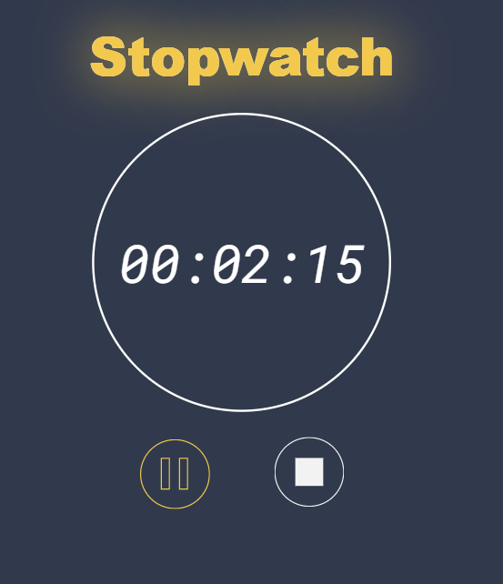

# Stop Watch

## Description

It's a basic stopwatch program I made from a tutorial. It has working "start", "stop", and "reset" buttons that function exactly how you'd think they function.



I'm working on a separate project that requires a stopwatch-function and I found this walkthrough. I found it incredibly helpful for what I'm about to work on ([Repo Here](https://github.com/ERion42/timeClock).)

## Table of Contents 

* [Installation](#installation)

* [Usage](#usage)

* [Contributing](#contributing)

* [Tests](#tests)

* [Questions](#questions)

## Installation

To install necessary dependencies, run the following command:

```
none
```


## Usage

This is a simple project so no installation is needed. It's also not my original work so I'll link the original walkthroughs.


# Original Walkthrough

Here is the original walkthrough- My code and the code for this shouldn't be 1:1 because of a few minor changes and the fact that my organization of the javascript is slightly different. If you're at all interested in this please check out their walkthrough: [here](https://medium.com/tinloof/how-to-build-a-stopwatch-with-html-css-and-plain-javascript-part-1-ea3537dbdd6c).


# Walkthrough Repo

Another good thing to check out would be the repo for the original walkthrough. You can find that [here](https://github.com/tinloof/gold-stopwatch).

  
## Contributing

I'd recommend contacting the creators of the original walkthrough, but feel free to contact me for any reason.


## Tests

To run tests, run the following command:

```
none
```

## Questions

If you have any questions about the repo, open an issue or contact me directly at erion3k@gmail.com. You can find more of my work at [ERion42](https://github.com/ERion42/).

